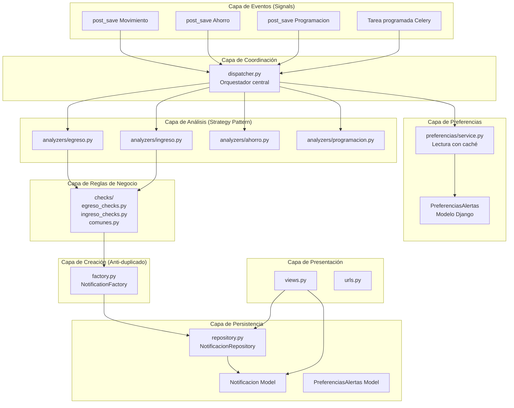
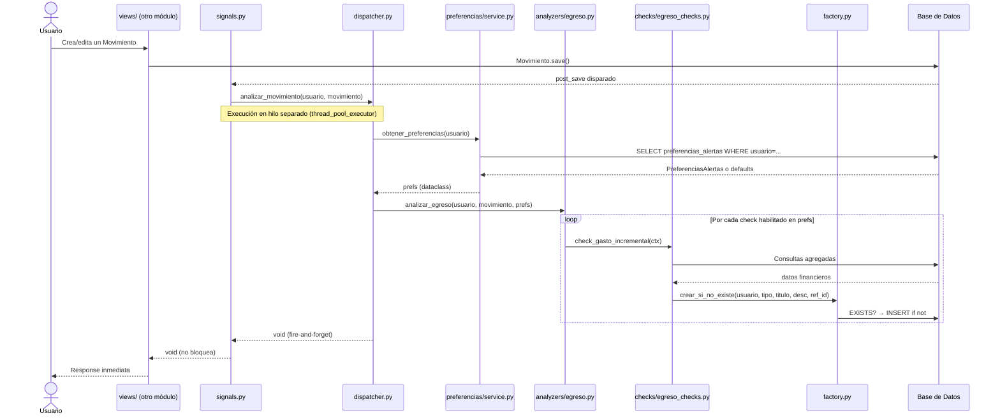

# Diseño Arquitectónico Empresarial — Módulo de Notificaciones (GastuDjango)

> **Rol:** Arquitecto de Software Senior — Django Empresarial  
> **Fecha:** Mayo 2026  
> **Referencia:** `GastuApp` (Spring Boot) → `GastuDjango` (Django)

---

## 0. Diagnóstico del Estado Actual

### Lo que YA existe en Django (bueno, conservar)

| Elemento | Archivo | Estado |
|---|---|---|
| Modelo `Notificacion` con 18 tipos | `models.py` | ✅ Conservar y extender |
| Clasificación por `Modulo` (6 módulos) | `models.py` | ✅ Conservar |
| Lógica de anti-duplicado diario | `services.py` | ✅ Conservar |
| 15 funciones de análisis financiero | `services.py` | ✅ Conservar lógica |
| Signal `post_save` en `Movimiento` | `signals.py` | ✅ Conservar y extender |
| `AppConfig.ready()` registra signals | `apps.py` | ✅ Correcto |
| Vista JSON con filtro por módulo | `views.py` | ✅ Conservar y extender |
| Marcar leídas (todas/IDs/módulo) | `views.py` | ✅ Conservar |

### Lo que FALTA comparado con Java (gaps críticos)

| Funcionalidad Java | Estado Django | Impacto |
|---|---|---|
| `PreferenciasAlertas` — 28 campos configurables por usuario | ❌ Ausente — hardcoded como constantes globales | 🔴 Alto |
| `AlertAnalysisService.@Async` — ejecución asíncrona | ❌ Ausente — bloquea la request del usuario | 🔴 Alto |
| `referenciaId` — enlace al objeto que disparó la alerta | ❌ Ausente en modelo | 🟡 Medio |
| `tipo` en notificación (PROGRAMACION/MOVIMIENTO/AHORRO/SISTEMA) | ❌ Ausente — Django solo tiene tipo de alerta | 🟡 Medio |
| `checkMetaAhorro` — alerta de meta de ahorro mensual | ❌ Ausente | 🟡 Medio |
| Control granular de alertas por usuario (enable/disable) | ❌ Ausente | 🔴 Alto |
| Parámetros numéricos personalizables por usuario | ❌ Ausente | 🔴 Alto |
| Señales para otros módulos (ahorro, programaciones) | ❌ Ausente | 🟡 Medio |
| Endpoint para marcar una sola notificación como leída | ❌ Ausente | 🟡 Medio |
| Admin registration | ❌ Vacío | 🟢 Bajo |

---

## 1. Arquitectura Completa del Módulo

### Visión General en Capas



---

## 2. Modelos Necesarios

### Modelo 1: `Notificacion` (refactorizado)

Mantiene la base actual + agrega `referencia_id` y `categoria_origen`:

```
Notificacion
├── id                  (auto)
├── usuario             (FK → AUTH_USER_MODEL)
├── tipo                (TextChoices — 18 tipos actuales)
├── modulo              (TextChoices — 6 módulos actuales)
├── titulo              (CharField 100)
├── descripcion         (TextField)
├── leida               (BooleanField default=False)
├── fecha_creacion      (DateTimeField auto_now_add)
├── referencia_id       (PositiveIntegerField nullable) ← NUEVO
└── referencia_tipo     (CharField nullable) ← NUEVO
    → 'movimiento' | 'ahorro' | 'programacion' | 'sistema'
```

**`referencia_id` + `referencia_tipo`** implementan la misma idea que Java (`referenciaId`) pero de forma más Pythonica, permitiendo enlazar la notificación a cualquier objeto del sistema.

---

### Modelo 2: `PreferenciasAlertas` (NUEVO — equivalente a `PreferenciasAlertas.java`)

Tabla independiente, relación OneToOne con el usuario. **No modifica ningún otro modelo existente.**

```
PreferenciasAlertas
├── id                                      (auto)
├── usuario                                 (OneToOneField → AUTH_USER_MODEL, related_name='prefs_alertas')
│
│   ── ALERTAS GENERALES ──
├── umbral_advertencia_porcentaje           (PositiveSmallIntegerField default=80)
├── egreso_grande_porcentaje                (PositiveSmallIntegerField default=30)
├── alerta_egreso_grande_activa             (BooleanField default=True)
│
│   ── TENDENCIAS ──
├── alert_gasto_incremental_enabled         (BooleanField default=True)
├── alert_gasto_incremental_porcentaje      (PositiveSmallIntegerField default=25)
├── alert_gasto_incremental_meses           (PositiveSmallIntegerField default=3)
├── alert_reduccion_ingresos_enabled        (BooleanField default=True)
├── alert_reduccion_ingresos_porcentaje     (PositiveSmallIntegerField default=20)
├── alert_patron_inusual_enabled            (BooleanField default=True)
│
│   ── CONCEPTOS / CATEGORÍAS ──
├── alert_concentracion_gastos_enabled      (BooleanField default=True)
├── alert_concentracion_gastos_porcentaje   (PositiveSmallIntegerField default=50)
├── alert_concepto_sin_uso_enabled          (BooleanField default=False)
├── alert_concepto_sin_uso_dias             (PositiveSmallIntegerField default=30)
│
│   ── TIEMPO ──
├── alert_velocidad_gasto_enabled           (BooleanField default=True)
├── alert_inactividad_ingresos_enabled      (BooleanField default=True)
├── alert_inactividad_dias                  (PositiveSmallIntegerField default=7)
├── alert_egresos_agrupados_enabled         (BooleanField default=True)
├── alert_egresos_agrupados_cantidad        (PositiveSmallIntegerField default=5)
├── alert_egresos_agrupados_horas           (PositiveSmallIntegerField default=2)
│
│   ── AHORRO / BALANCE ──
├── meta_ahorro_mensual                     (DecimalField 12,2 default=0)
├── alert_meta_ahorro_enabled               (BooleanField default=False)
├── alert_balance_critico_enabled           (BooleanField default=True)
│
│   ── MICRO-GASTOS ──
├── alert_micro_gastos_enabled              (BooleanField default=True)
├── alert_micro_gastos_cantidad             (PositiveSmallIntegerField default=10)
├── alert_micro_gastos_monto_max            (DecimalField 12,2 default=10000)
├── alert_gastos_hormiga_enabled            (BooleanField default=True)
├── alert_gastos_hormiga_monto_dia          (DecimalField 12,2 default=50000)
│
│   ── PREDICTIVAS ──
├── alert_proyeccion_sobregasto_enabled     (BooleanField default=True)
├── alert_comparacion_periodo_enabled       (BooleanField default=True)
├── alert_dia_mes_critico_enabled           (BooleanField default=True)
├── alert_dia_mes_critico_porcentaje        (PositiveSmallIntegerField default=70)
│
│   ── INCONSISTENCIAS ──
├── alert_egreso_sin_concepto_enabled       (BooleanField default=False)
├── alert_egreso_sin_concepto_cantidad      (PositiveSmallIntegerField default=5)
├── alert_ingreso_inusual_enabled           (BooleanField default=True)
└── alert_ingreso_inusual_multiplicador     (DecimalField 4,2 default=2.5)
```

> **Nota de moneda:** Los umbrales de monto (`monto_max`, `hormiga`, etc.) en Django están en pesos colombianos (COP). Los valores por defecto equivalen a los de Java convertidos a COP.

---

## 3. Relaciones Entre Entidades

```mermaid
erDiagram
    Usuario ||--o{ Notificacion : "recibe"
    Usuario ||--|| PreferenciasAlertas : "tiene"
    Notificacion }o--o| Movimiento : "referencia_id (opcional)"
    Notificacion }o--o| Ahorro : "referencia_id (opcional)"
    Notificacion }o--o| Programacion : "referencia_id (opcional)"

    Usuario {
        int id PK
        string username
        string email
    }

    Notificacion {
        int id PK
        int usuario_id FK
        string tipo
        string modulo
        string titulo
        text descripcion
        bool leida
        datetime fecha_creacion
        int referencia_id
        string referencia_tipo
    }

    PreferenciasAlertas {
        int id PK
        int usuario_id FK_UNIQUE
        int umbral_advertencia_porcentaje
        bool alert_gasto_incremental_enabled
        int alert_gasto_incremental_porcentaje
        decimal meta_ahorro_mensual
        bool alert_meta_ahorro_enabled
        int N_campos_mas
    }
```

**Principio de desacoplamiento:** `Notificacion` usa `referencia_id` + `referencia_tipo` (dos campos simples) en lugar de ForeignKeys directas a cada modelo. Esto es equivalente al patrón de Java y evita dependencias circulares entre apps.

---

## 4. Flujo de Eventos



---

## 5. Sistema de Preferencias

### Estrategia de Diseño

La clave es reemplazar las **constantes globales** del `services.py` actual por **valores por usuario** almacenados en `PreferenciasAlertas`, manteniendo valores por defecto sensatos para usuarios sin configuración.

### Componentes del Sistema de Preferencias

```
notificaciones/
└── preferencias/
    ├── __init__.py
    ├── models.py        → PreferenciasAlertas (la entidad)
    ├── defaults.py      → Dataclass con valores por defecto (espejo de las constantes actuales)
    ├── service.py       → PreferenciasService: get_or_create con caché
    ├── views.py         → Endpoints CRUD para gestionar preferencias
    ├── urls.py          → /notificaciones/preferencias/
    ├── forms.py         → ModelForm para el panel de configuración
    ├── serializers.py   → Serialización a dict para pasar a los checks
    └── admin.py         → Registro en panel admin
```

### Flujo de acceso a preferencias

```
PreferenciasService.obtener(usuario)
    ├── Intenta: PreferenciasAlertas.objects.get(usuario=usuario)
    ├── Si no existe: PreferenciasAlertas.objects.create(usuario=usuario)
    │   → usa valores por defecto de defaults.py
    └── Retorna: dataclass PrefsDTO (valores ya deserializados)
```

**Por qué dataclass y no el ORM directamente:** Evita N+1 queries en los checks. El dataclass se llena una vez al inicio del análisis y se pasa como contexto a todos los checks.

### Valores por Defecto (equivalencia Java → Django)

| Preferencia | Java Default | Django Default | Unidad |
|---|---|---|---|
| `umbral_advertencia_porcentaje` | 80 | 80 | % |
| `egreso_grande_porcentaje` | 30 | 30 | % |
| `alert_gasto_incremental_porcentaje` | 25 | 25 | % |
| `alert_gasto_incremental_meses` | 3 | 3 | meses |
| `alert_reduccion_ingresos_porcentaje` | 20 | 20 | % |
| `alert_concentracion_gastos_porcentaje` | 50 | 50 | % |
| `alert_concepto_sin_uso_dias` | 30 | 30 | días |
| `alert_inactividad_dias` | 7 | 7 | días |
| `alert_egresos_agrupados_cantidad` | 5 | 5 | transacciones |
| `alert_egresos_agrupados_horas` | 2 | 2 | horas |
| `meta_ahorro_mensual` | 0.00 | 0 | COP |
| `alert_micro_gastos_cantidad` | 10 | 10 | transacciones |
| `alert_micro_gastos_monto_max` | 5.00 USD | 10,000 COP | COP |
| `alert_gastos_hormiga_monto_dia` | 10.00 USD | 50,000 COP | COP |
| `alert_dia_mes_critico_porcentaje` | 70 | 70 | % |
| `alert_egreso_sin_concepto_cantidad` | 5 | 5 | movimientos |
| `alert_ingreso_inusual_multiplicador` | 2x | 2.5x | multiplicador |

---

## 6. Cómo Desacoplar la Lógica

### Problema actual

`services.py` es un **God Object**: 1009 líneas, todo mezclado, imports circulares dentro de funciones, constantes globales, sin separación de responsabilidades.

### Solución: Contexto de Análisis + Strategy Pattern

**Desacoplar en 4 capas:**

```
┌──────────────────────────────────────────────────┐
│ CAPA 1: Context Object (AnalysisContext)         │
│  → Agrupa: usuario, movimiento, prefs, now       │
│  → Se crea UNA vez por análisis                  │
│  → Elimina el paso de múltiples args a cada fn   │
└──────────────────────────────────────────────────┘
         ↓
┌──────────────────────────────────────────────────┐
│ CAPA 2: Analyzers (por tipo de movimiento)       │
│  → EgresoAnalyzer, IngresoAnalyzer               │
│  → Cada uno sabe qué checks ejecutar             │
│  → Filtra checks según prefs del usuario         │
└──────────────────────────────────────────────────┘
         ↓
┌──────────────────────────────────────────────────┐
│ CAPA 3: Checks (una función = una regla)         │
│  → Reciben AnalysisContext                       │
│  → Retornan NotificationRequest o None           │
│  → NUNCA crean la notificación ellos mismos      │
└──────────────────────────────────────────────────┘
         ↓
┌──────────────────────────────────────────────────┐
│ CAPA 4: NotificationFactory                      │
│  → Recibe NotificationRequest                    │
│  → Aplica lógica anti-duplicado                  │
│  → Escribe en DB                                 │
└──────────────────────────────────────────────────┘
```

**Ventaja:** Cada check solo hace UNA cosa. El anti-duplicado está centralizado. Los checks son 100% testeables de forma unitaria sin DB.

---

## 7. Cómo Manejar Notificaciones Automáticas

### Tipo A: Triggered (basadas en eventos, on-demand)

Disparadas por signals cuando ocurre un movimiento. Es el modelo actual, que se **conserva y extiende** a más señales:

```
Signal: post_save(Movimiento)     → analizar_movimiento()
Signal: post_save(Ahorro)         → analizar_ahorro()     [NUEVO]
Signal: post_save(Programacion)   → analizar_programacion() [NUEVO]
```

### Tipo B: Scheduled (basadas en tiempo, periódicas)

Alertas que no dependen de un movimiento sino del paso del tiempo:

```
- INACTIVIDAD_INGRESOS: ¿No has registrado ingresos en N días?
- CONCEPTO_SIN_USO: ¿Una categoría recurrente sin actividad?
```

**Implementación en Django sin Celery** (compatible con la arquitectura actual):

- Usar `django-crontab` o un management command ejecutado por el cron del sistema operativo.
- Alternativamente: evaluar al momento del login del usuario (lazy evaluation).

**Implementación con Celery** (si se instala en el futuro):

```python
@shared_task
def analizar_alertas_periodicas():
    # Recorre usuarios activos y verifica alertas de inactividad
```

> **Recomendación para el estado actual del proyecto:** Implementar las alertas periódicas como un **Django management command** (`manage.py analizar_inactividad`) ejecutado diariamente vía cron del SO. Esto no requiere instalar ninguna dependencia nueva.

### Tipo C: Manual (creadas por el propio usuario o admin)

Equivalente al `POST /api/notificaciones` de Java. Útil para mensajes del sistema:

```
POST /notificaciones/crear/
Body: { tipo, titulo, descripcion, referencia_id? }
```

---

## 8. Cómo Integrar Señales/Eventos

### Diseño de Signals Actual → Extendido

```python
# signals.py (versión extendida)

@receiver(post_save, sender='movimientos.Movimiento')
def on_movimiento_guardado(sender, instance, created, **kwargs):
    from .dispatcher import analizar_movimiento_async
    analizar_movimiento_async(instance.usuario, instance)

@receiver(post_save, sender='ahorros.Ahorro')        # NUEVO
def on_ahorro_guardado(sender, instance, created, **kwargs):
    from .dispatcher import analizar_ahorro_async
    analizar_ahorro_async(instance.usuario, instance)

@receiver(post_save, sender='programaciones.Programacion')  # NUEVO
def on_programacion_guardada(sender, instance, created, **kwargs):
    from .dispatcher import analizar_programacion_async
    analizar_programacion_async(instance.usuario, instance)
```

### Asincronía sin Celery: ThreadPoolExecutor

Para replicar el `@Async` de Java sin instalar Celery:

```python
# dispatcher.py
import concurrent.futures

_executor = concurrent.futures.ThreadPoolExecutor(max_workers=4)

def analizar_movimiento_async(usuario, movimiento):
    """Fire-and-forget: no bloquea la request del usuario."""
    _executor.submit(_analizar_movimiento_seguro, usuario, movimiento)

def _analizar_movimiento_seguro(usuario, movimiento):
    try:
        prefs = PreferenciasService.obtener(usuario)
        if movimiento.tipo == 'EGRESO':
            EgresoAnalyzer(usuario, movimiento, prefs).analizar()
        else:
            IngresoAnalyzer(usuario, movimiento, prefs).analizar()
    except Exception as e:
        logger.error(f'[notificaciones] Error analizando movimiento #{movimiento.pk}: {e}')
```

> **¿Por qué ThreadPoolExecutor?** Es parte de la biblioteca estándar de Python. No requiere Redis, RabbitMQ ni workers extra. Para un proyecto en crecimiento es suficiente. La migración a Celery en el futuro solo requiere cambiar el `submit()` por `task.delay()`.

---

## 9. Separación de Responsabilidades (SRP)

| Responsabilidad | Archivo | Descripción |
|---|---|---|
| **Definición de datos** | `models.py` | Solo modelo `Notificacion` + choices |
| **Preferencias de alertas** | `preferencias/models.py` | Solo `PreferenciasAlertas` |
| **Defaults y constantes** | `preferencias/defaults.py` | Valores por defecto (reemplaza las constantes globales actuales) |
| **Acceso a preferencias** | `preferencias/service.py` | `get_or_create` + serialización a dataclass |
| **Señales/Eventos** | `signals.py` | Solo recibir señales y delegar al dispatcher |
| **Orquestación** | `dispatcher.py` | Decide qué analyzer ejecutar, maneja asincronía |
| **Análisis de egresos** | `analyzers/egreso.py` | Solo selección de checks para egresos |
| **Análisis de ingresos** | `analyzers/ingreso.py` | Solo selección de checks para ingresos |
| **Reglas de negocio egresos** | `checks/egreso_checks.py` | Las 15 funciones de análisis actuales |
| **Reglas de negocio ingresos** | `checks/ingreso_checks.py` | Las funciones de análisis de ingresos |
| **Helpers de consulta** | `checks/query_helpers.py` | `_total_en_rango`, `_count_en_rango`, `_inicio_mes`, etc. |
| **Creación de notificaciones** | `factory.py` | Anti-duplicado + `Notificacion.objects.create()` |
| **Acceso a datos** | `repository.py` | Queryset reutilizables (listados, conteos, filtros) |
| **Presentación HTTP** | `views.py` | Solo HTTP → llamadas al repository |
| **Rutas** | `urls.py` | Solo URL patterns |
| **Admin** | `admin.py` | Registro en Django Admin |
| **Configuración de app** | `apps.py` | Solo `ready()` para registrar signals |

---

## 10. Patrones de Diseño a Utilizar

### 1. Strategy Pattern — Selección de Analyzer

```
Dispatcher → EgresoAnalyzer | IngresoAnalyzer | AhorroAnalyzer
```
Cada analyzer implementa el mismo protocolo (`analizar(ctx)`). Añadir un nuevo tipo de análisis es crear una clase nueva sin modificar el dispatcher.

### 2. Context Object Pattern — AnalysisContext

```python
@dataclass
class AnalysisContext:
    usuario: AbstractBaseUser
    movimiento: object        # Movimiento | Ahorro | Programacion
    prefs: PrefsDTO
    now: datetime
    tipo_movimiento: str      # 'EGRESO' | 'INGRESO'
```
Elimina el problema actual de pasar `usuario` + `movimiento` como dos argumentos separados a cada una de las 15 funciones.

### 3. Factory Method Pattern — NotificationFactory

```python
class NotificationFactory:
    @staticmethod
    def crear_si_no_existe(ctx, tipo, titulo, descripcion):
        # Anti-duplicado centralizado
        # Asignación automática de módulo
        # Asignación de referencia_id desde el contexto
```

### 4. Repository Pattern — NotificacionRepository

```python
class NotificacionRepository:
    def listar_por_usuario(usuario, modulo=None, solo_no_leidas=False): ...
    def contar_no_leidas(usuario): ...
    def marcar_leidas(usuario, ids=None, modulo=None): ...
    def obtener_o_404(pk, usuario): ...
```
Las views solo hablan con el repository, no con el ORM directamente.

### 5. Guard Clause Pattern — En cada check

```python
def check_umbral_mensual(ctx: AnalysisContext) -> Optional[NotificationRequest]:
    if not ctx.prefs.alert_umbral_mensual_enabled:
        return None  # Guard: alert deshabilitada
    resumen = obtener_resumen_mensual(ctx.usuario)
    if not resumen or resumen.total_ingresos <= 0:
        return None  # Guard: datos insuficientes
    # ... lógica real
```

### 6. Null Object Pattern — PrefsDTO con defaults

Si el usuario no tiene `PreferenciasAlertas`, el service retorna un `PrefsDTO` con todos los valores por defecto. Los checks nunca necesitan manejar el caso "sin preferencias".

---

## 11. Estructura de Carpetas/Módulos a Crear

```
notificaciones/
│
├── __init__.py
├── apps.py                    # AppConfig — registra signals en ready()
├── admin.py                   # Registro en Django Admin (actualmente vacío)
├── urls.py                    # Rutas del módulo
├── models.py                  # Solo modelo Notificacion (extendido)
├── views.py                   # Vistas HTTP (extendidas)
│
├── dispatcher.py              # [NUEVO] Orquestador — recibe señales y coordina
├── factory.py                 # [NUEVO] NotificationFactory — anti-duplicado
├── repository.py              # [NUEVO] Queryset reutilizables
├── signals.py                 # [EXISTENTE] Extendido con más señales
│
├── preferencias/              # [NUEVO] Sub-módulo de preferencias
│   ├── __init__.py
│   ├── models.py              # Modelo PreferenciasAlertas
│   ├── defaults.py            # Dataclass PrefsDTO + valores por defecto
│   ├── service.py             # PreferenciasService.obtener(usuario)
│   ├── views.py               # CRUD de preferencias (GET/POST)
│   ├── urls.py                # /notificaciones/preferencias/
│   ├── forms.py               # ModelForm para el panel de usuario
│   └── admin.py               # Registro en Django Admin
│
├── analyzers/                 # [NUEVO] Analyzers por tipo
│   ├── __init__.py
│   ├── base.py                # Clase base BaseAnalyzer (protocolo)
│   ├── egreso.py              # EgresoAnalyzer
│   ├── ingreso.py             # IngresoAnalyzer
│   ├── ahorro.py              # AhorroAnalyzer (futuro)
│   └── programacion.py        # ProgramacionAnalyzer (futuro)
│
├── checks/                    # [NUEVO] Reglas de negocio individuales
│   ├── __init__.py
│   ├── context.py             # Dataclass AnalysisContext
│   ├── query_helpers.py       # _total_en_rango, _inicio_mes, etc.
│   ├── egreso_checks.py       # 15 funciones de análisis de egresos
│   └── ingreso_checks.py      # 4 funciones de análisis de ingresos
│
├── migrations/                # [EXISTENTE] + nuevas migraciones
│   └── ...
│
└── tests/                     # [NUEVO] Tests unitarios e integración
    ├── __init__.py
    ├── test_checks.py         # Unit tests por check (sin DB)
    ├── test_factory.py        # Test anti-duplicado
    ├── test_preferencias.py   # Test servicio de preferencias
    └── test_views.py          # Test vistas HTTP
```

---

## 12. Mantenibilidad y Escalabilidad

### Mantenibilidad

**Agregar un nuevo tipo de alerta requiere SOLO:**
1. Agregar el tipo en `Notificacion.Tipo` (choices)
2. Agregar la función en `checks/egreso_checks.py` o `ingreso_checks.py`
3. Agregar la llamada en `analyzers/egreso.py` o `ingreso.py` con la guard de prefs
4. (Opcional) Agregar el campo de preferencia en `PreferenciasAlertas`

**Agregar un nuevo módulo fuente requiere SOLO:**
1. Agregar el signal en `signals.py`
2. Crear `analyzers/nuevo_modulo.py`
3. Agregar la llamada en `dispatcher.py`

### Escalabilidad

| Necesidad | Solución Actual | Migración Futura |
|---|---|---|
| Asincronía | ThreadPoolExecutor | Cambiar `submit()` por `celery_task.delay()` |
| Caché de preferencias | `get_or_create` directo | Agregar `django-cacheops` o Redis cache |
| Notificaciones en tiempo real | Polling desde frontend | WebSockets con Django Channels |
| Auditoría de alertas | Log en consola | Agregar campo `procesado_en` + tabla `LogAlerta` |

### Logging Empresarial

Reemplazar todos los `print(f'[notificaciones] Error...')` por:

```python
import logging
logger = logging.getLogger('notificaciones')

# En cada check:
logger.exception(f'Error en check_umbral_mensual para usuario {ctx.usuario.pk}')
```

Configurar en `settings.py` con handler a archivo/Sentry.

---

## 13. Que No Rompa Ningún Otro Módulo

### Principio de No-Ruptura

El módulo de notificaciones es **listener puro**: solo consume datos de otros módulos, nunca los modifica.

### Reglas de Integración

| Regla | Detalle |
|---|---|
| **Sin imports circulares** | Los checks hacen imports locales dentro de la función (`from movimientos.models import Movimiento`) |
| **Siempre en try/except** | Cada check tiene su propio try/except para que un error no rompa los demás checks ni la operación principal |
| **Fire-and-forget** | El dispatcher ejecuta el análisis de forma asíncrona (ThreadPoolExecutor). Un fallo en notificaciones NUNCA propaga excepciones al módulo que disparó la señal |
| **Sin modificar otros models** | `PreferenciasAlertas` es una tabla nueva. No modifica `usuarios`, `movimientos` ni ningún otro modelo |
| **OneToOne con get_or_create** | Si el usuario no tiene preferencias, se crean automáticamente con defaults. La app no falla |
| **Señales por string** | `sender='movimientos.Movimiento'` (string, no import) evita dependencias en tiempo de import |

### Mapa de dependencias del módulo

```
notificaciones → lee de:
    ├── movimientos.models.Movimiento        (solo lectura)
    ├── categorias.models.Categoria          (solo lectura)
    ├── dashboard.models.ResumenMensual      (solo lectura)
    ├── ahorros.models.Ahorro                (solo lectura, futuro)
    └── programaciones.models.Programacion   (solo lectura, futuro)

Otros módulos → NO dependen de notificaciones
    → La relación es UNIDIRECCIONAL
```

---

## 14. Comparativa Final: Java vs. Django Rediseñado

```mermaid
graph LR
    subgraph JAVA["Spring Boot (referencia)"]
        J1[PreferenciasAlertas.java\n28 campos]
        J2[AlertAnalysisService.java\n@Async + 15 checks con prefs]
        J3[NotificacionService.java\nCRUD básico]
        J4[NotificacionController.java\nREST endpoints]
        J5[NotificacionRepository.java\n3 queries]
        J6[Notificacion.java\n4 tipos + referenciaId]
    end

    subgraph DJANGO["Django Rediseñado"]
        D1[preferencias/models.py\n38 campos]
        D2[analyzers/ + checks/\nAsync con ThreadPoolExecutor]
        D3[factory.py + repository.py\nCRUD + anti-duplicado]
        D4[views.py + urls.py\nJSON views + preferencias CRUD]
        D5[repository.py\nQuerysets reutilizables]
        D6[models.py\n18 tipos + referencia_id + referencia_tipo]
    end

    J1 -.equivale.- D1
    J2 -.equivale.- D2
    J3 -.equivale.- D3
    J4 -.equivale.- D4
    J5 -.equivale.- D5
    J6 -.equivale.- D6
```

---

## Resumen Ejecutivo de Cambios

| # | Qué cambiar | Por qué |
|---|---|---|
| 1 | Agregar `referencia_id` + `referencia_tipo` a `Notificacion` | Paridad con Java, trazabilidad |
| 2 | Crear `preferencias/models.py` con `PreferenciasAlertas` | El gap más crítico — actualmente los umbrales son globales |
| 3 | Crear `preferencias/service.py` con `get_or_create` + caché | Performance + código limpio |
| 4 | Crear `checks/context.py` — dataclass `AnalysisContext` | Desacoplamiento, testabilidad |
| 5 | Refactorizar `services.py` en `checks/egreso_checks.py` + `ingreso_checks.py` | SRP, mantenibilidad |
| 6 | Crear `factory.py` — centralizar anti-duplicado | Actualmente disperso |
| 7 | Crear `dispatcher.py` — ThreadPoolExecutor | Asincronía, equivalente a @Async |
| 8 | Crear `analyzers/egreso.py` + `ingreso.py` | Strategy Pattern, condicionado por prefs |
| 9 | Implementar `check_meta_ahorro` | Paridad con Java — alert faltante |
| 10 | Extender `signals.py` con señales de ahorro y programaciones | Cobertura completa |
| 11 | Crear `repository.py` | Queries reutilizables, separar de views |
| 12 | Extender `views.py` + `urls.py` con endpoints de preferencias | UI de configuración |
| 13 | Crear `tests/` | Cobertura de calidad empresarial |
| 14 | Rellenar `admin.py` | Operaciones internas |

> **El objetivo:** El módulo de notificaciones de Django debe comportarse como el de Java: asíncrono, configurable por usuario, desacoplado, extensible y sin romper nada.
